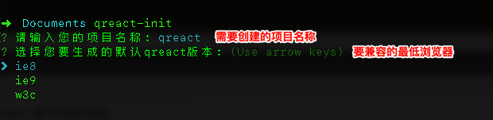

## 简介

使用我们提供的 QReact-Cli 工具，自动化部署和升级 Qreact 项目

## 环境要求

Node.js（> = 4.x)，npm版本3+

## 安装
1. `npm install qreact-cli -g` // 全局安装 QReact-Cli
2. 运行 `qreact init` // 初始化QReact项目

3. `npm install` // 进入项目安装依赖包
4. `npm run start ` // 启动开发环境
5. 访问 `http://localhost:8081/ ` // 打开项目

## 帮助命令
运行 `qreact` 显示帮助信息

## QReact 打包
运行 `npm run build` 编译生产环境配置文件

